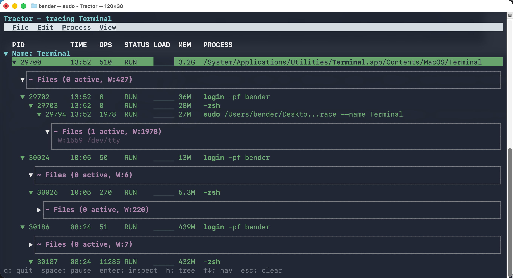
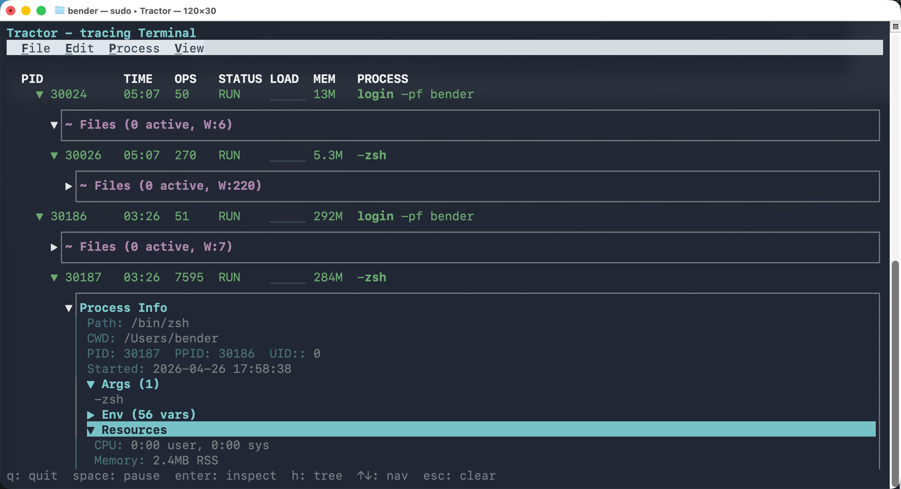
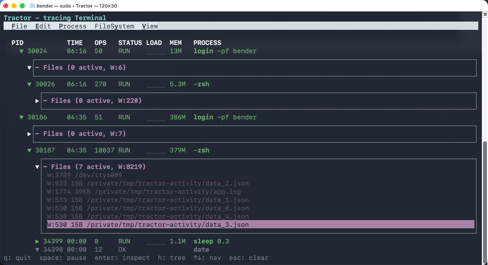
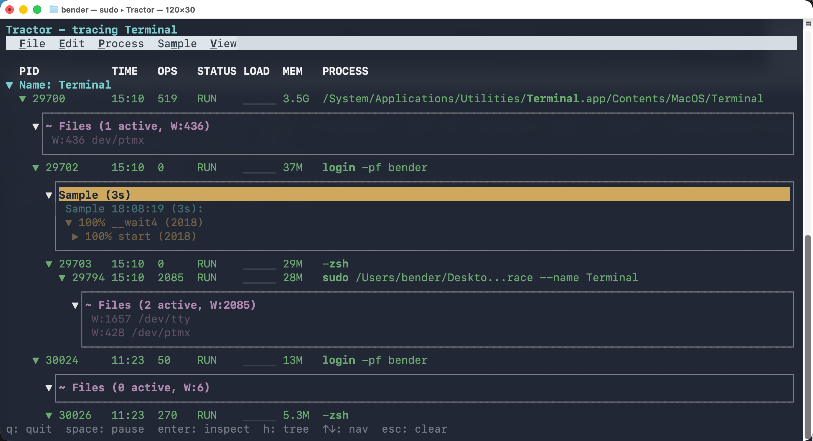
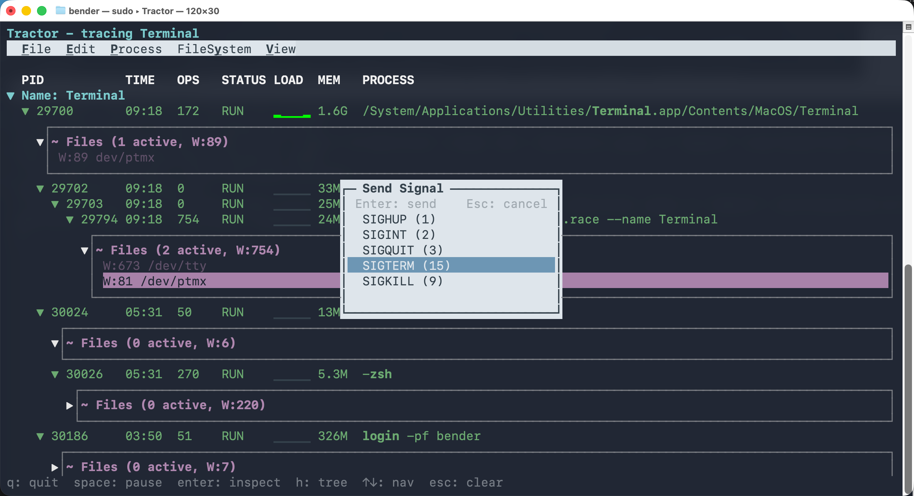

# Tractor

<p align="center">
  
<br/>
</p>

Tractor is a real-time process monitor for macOS. It traces the full process tree, file activity, and network connections, then presents everything in an interactive terminal UI. 

> [!NOTE]
> Tractor captures all child-processes, including very short-lived subprocesses.

<p align="center">
  
</p>

## Why?

With AI and agent development, thousands of processes can get spawned during a session without human oversight.

Tractor creates a full audit log of agent activity, for archive and analysis.

## Features

**Process tree** — live hierarchical view of all traced processes with PID, runtime, CPU, memory, and full command line. Auto-discovers matching processes and captures 100% of their child processes, no matter how short-lived.

**Process inspection** — full path, working directory, arguments, environment variables, and resource usage.

<p align="center">
  
</p>

**File tracking** — real-time observation of file writes, renames, and deletes per process with write counts and byte sizes.

<p align="center">
  
</p>

**Network connections** — per-connection TX/RX byte counters with hostname resolution.

<p align="center">
  
</p>

**TLS interception** — transparent MITM proxy decrypts HTTPS traffic. See HTTP requests and responses with full headers and body. Supports chunked transfer encoding and gzip/deflate decompression.

<p align="center">
  
</p>

<p align="center">
  
</p>

<p align="center">
  
</p>

**CPU sampling** — capture CPU profiles displayed as a bottom-up call tree.

<p align="center">
  
</p>

**Wait diagnosis** — find out why a process is blocked (I/O, locks, network, sleep).

**Signal delivery** — send signals or pause/resume any traced process.

<p align="center">
  
</p>

**JSON output** — stream events as newline-delimited JSON for scripting.

**SQLite logging** — persist all events and HTTP traffic to a database.

## Quick Start

Install a signed, notarized release from the [Releases page](https://github.com/groundwater/Tractor/releases) and open the included `.pkg`, then activate the required system components:

```bash
sudo tractor activate endpoint-security
sudo tractor activate network-extension
```

Then start tracing:

```bash
tractor trace --name Terminal
```

> [!NOTE]
> Tractor's release builds are signed, provisioned with the required Endpoint Security entitlement, and notarized. You do not need to disable SIP to use the packaged release build.

If you want to build from source for local development:

```bash
git clone https://github.com/groundwater/Tractor.git
cd Tractor
make debug
sudo .build/Debug/Tractor activate endpoint-security
.build/Debug/Tractor trace --name Terminal
```

Requires Xcode, [XcodeGen](https://github.com/yonaskolb/XcodeGen), and macOS 15+.

> [!TIP]
> Tractor is especially useful for agent workflows where one top-level command fans out into many subprocesses. For example, to trace Claude and inspect its HTTPS traffic:
>
> ```bash
> tractor trace --name claude --mitm
> ```

### TLS Interception Setup

```bash
make install
sudo tractor activate endpoint-security
sudo tractor activate network-extension
sudo tractor activate certificate-root
tractor trace --name claude --mitm
```

## Development Setup

Tractor uses Apple's Endpoint Security framework, which is gated by a restricted entitlement. The packaged release build is signed, provisioned, and notarized correctly, so it runs normally on macOS.

For local development, `make debug` produces an ad-hoc signed build for iteration. Because that build does not ship with the production signing and provisioning chain, you should use a macOS VM with SIP disabled.

<details>
<summary>VM setup</summary>

Using [GhostVM](https://github.com/groundwater/GhostVM) or any macOS VM, boot into Recovery Mode and run `csrutil disable`.

</details>

<details>
<summary>Production distribution</summary>

Production distribution requires a provisioning profile with the Endpoint Security entitlement, Developer ID signing, hardened runtime, notarization, and Full Disk Access.

</details>

### Build Targets

| Target | Description |
|--------|-------------|
| `make debug` | Ad-hoc signed Debug build for local development (use with SIP disabled in a VM) |
| `make release` | Release .app bundle with embedded system extension |
| `make install` | Install to `/Applications/Tractor.app` |

## License

GNU Affero General Public License v3.0
