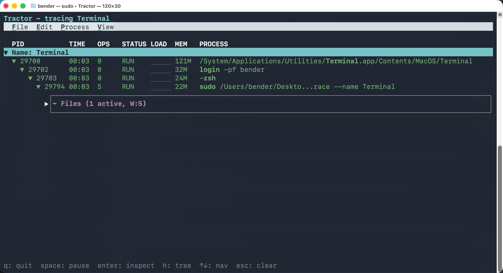
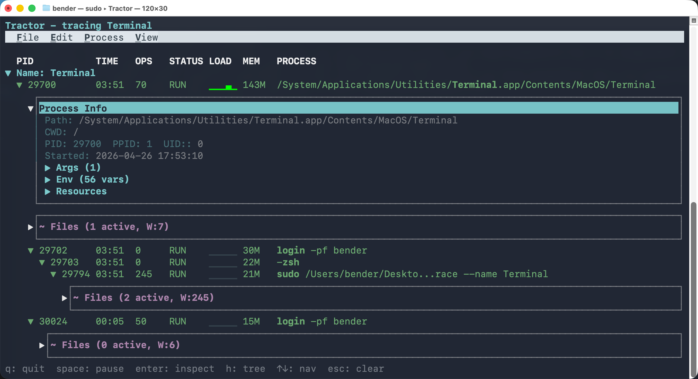
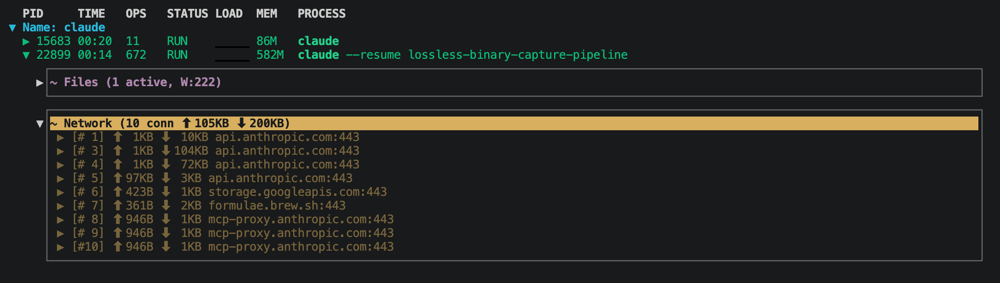
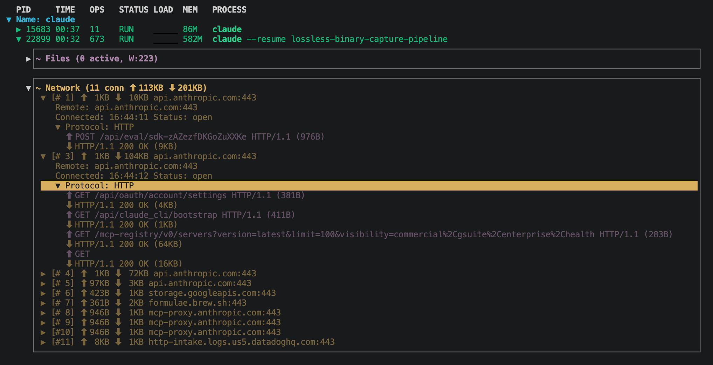
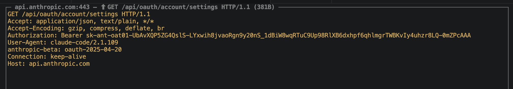
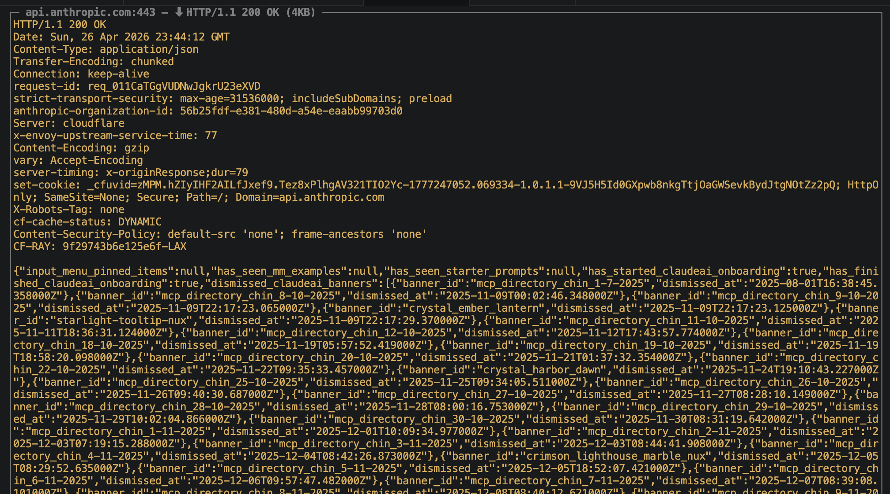
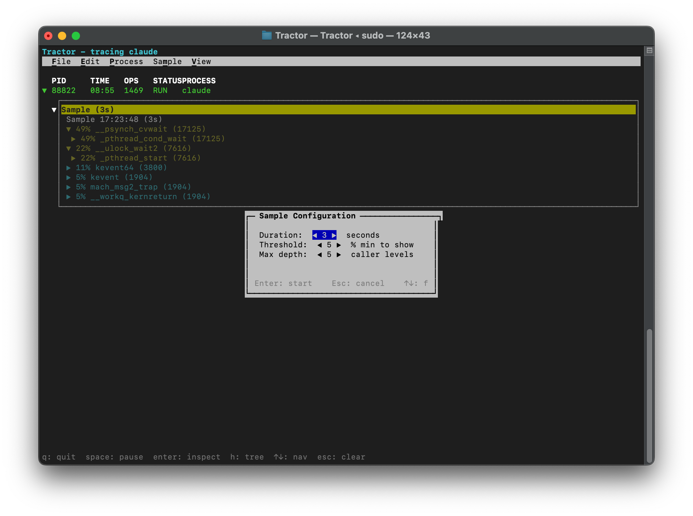
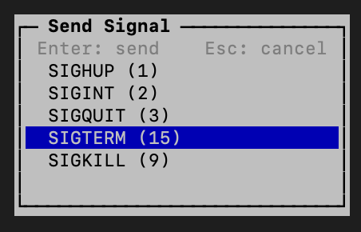

# Tractor

<p align="center">
  
</p>

**Know what your AI agents are up to.**

Tractor is a real-time process monitor for AI coding agents on macOS. It traces an agent's process tree, file activity, and network connections — then presents everything in an interactive terminal UI. Optionally intercept TLS traffic to inspect the actual HTTP requests your agent is making.

<p align="center">
  
</p>

## Why?

AI coding agents spawn dozens of subprocesses, write to files across your filesystem, and make network requests — all in seconds. Tractor gives you visibility into this activity with low overhead.

- **Process tree** — subprocesses nested by parent-child relationship, with auto-discovery of new agent instances
- **File tracking** — writes, renames, and deletes observed in real-time per process
- **Network connections** — per-connection byte counters (TX/RX) with hostname resolution
- **TLS interception** — optional MITM proxy decrypts HTTPS traffic and displays HTTP request/response content
- **CPU profiling** — sample any process to see where it's spending CPU time
- **Wait diagnosis** — find out why a process is blocked (I/O, lock, sleep, etc.)
- **Signal delivery** — send SIGHUP/SIGINT/SIGQUIT/SIGTERM/SIGKILL to any traced process
- **JSON output** — newline-delimited JSON events for scripting and analysis
- **SQLite logging** — persist all events and HTTP traffic to a database for post-hoc analysis

## Quick Start

```bash
git clone https://github.com/groundwater/Tractor.git
cd Tractor
make debug
sudo .build/Debug/Tractor trace --name Terminal
```

Open a new terminal tab and run some commands — you'll see them appear in Tractor's process tree. Press `?` for keyboard shortcuts, `q` to quit.

> [!WARNING]
> Tractor uses Apple's Endpoint Security framework, which requires SIP to be disabled for unsigned builds. See [Development Setup](#development-setup) for details.

Requires Xcode, [XcodeGen](https://github.com/yonaskolb/XcodeGen), and macOS 15+.

## Features

### Process Tree

The main view shows all traced processes in a hierarchical tree. Each row displays:

| Column | Description |
|--------|-------------|
| PID | Process ID |
| TIME | Wall-clock runtime (HH:MM:SS) |
| OPS | File operation count |
| STATUS | `RUN`, `STOP`, `ERR <code>`, or `OK` |
| LOAD | CPU sparkline (green/yellow/red gradient, last 5 samples) |
| MEM | Resident memory (e.g. `240M`, `1.2G`) |
| PROCESS | Command line with binary name in bold |

Processes are auto-discovered by name substring, exact PID, or exact executable path. Children inherit their parent's tracker group, so the entire subtree is captured automatically. Short-lived subprocesses are caught via `AUTH_EXEC` before they can exit unseen.

Toggle between **tree view** (hierarchical) and **flat view** with `h`.

### Process Info

Select a process and press `i` to inspect it. The info panel shows:

- **Path** — full executable path
- **CWD** — current working directory
- **IDs** — PID, PPID, UID
- **Started** — start timestamp
- **Args** — full argv (collapsible)
- **Env** — environment variables (collapsible)
- **Resources** — CPU time (user/sys), RSS memory, open FD count, disk bytes read/written (collapsible)

<p align="center">
  
</p>

### File Tracking

Press `d` to view file activity for a process. Tractor observes:

- **Writes** — direct writes and modified-on-close events
- **Renames** — atomic saves (write-to-temp + rename)
- **Deletes** — unlink operations

Each file shows its write count, size, and path (relative to the process CWD when possible). Files are sorted by most recent activity, pruned to the last 200 per process.

The Files panel auto-expands when a traced process writes to disk and auto-collapses after 5 seconds of inactivity. Manual toggle with `d` overrides auto behavior.

**FileSystem menu** (`y`): toggle hide inactive files, show reads, show writes.

### Network Connections

Press `n` to view network connections for a process. Each connection shows:

- Connection number within the process (`#1`, `#2`, ...)
- TX/RX byte counts with directional arrows (`↑` / `↓`)
- Remote hostname (resolved via reverse DNS or SNI extraction) and port
- Connection status (open/closed) and timestamps
- Lifetime aggregate byte totals per process

Expand a connection to see protocol details. For HTTP connections (with `--mitm`), you'll see individual request/response round-trips. Press `Enter` on a round-trip to open the full-screen **Traffic Modal** showing complete headers and body.

**Network menu** (`t`): toggle show all connections (including closed), reverse DNS, SNI inspection, and decode mode (HTTP / hexdump / auto).

<p align="center">
  
</p>

### TLS Interception (MITM)

With `--mitm`, Tractor acts as a transparent TLS proxy and decrypts HTTPS traffic from traced processes. This lets you see the actual HTTP requests and responses your agent is making — method, URL, headers, and body.

**How it works:**

1. A system extension (TractorNE) intercepts TCP flows from watched processes
2. For TLS ports (443, 8443, 4443), the extension terminates TLS using a dynamically-generated leaf certificate signed by Tractor's CA
3. A separate TLS connection is made to the real server
4. Plaintext HTTP is captured in both directions and reported back to the TUI via XPC

**One-time setup:**

```bash
# Install the app bundle and activate the system extension
make install
make activate

# Generate and trust the MITM CA certificate
sudo tractor trust-ca
```

The CA is stored in the app group container (`group.com.jacobgroundwater.Tractor`) and installed into both the system keychain and `/etc/ssl/cert.pem`.

<p align="center">
  
</p>

Press Enter on any frame to open the full-screen traffic inspector:

<p align="center">
  
</p>

<p align="center">
  
</p>

**Then trace with MITM enabled:**

```bash
sudo tractor trace --name claude --mitm
```

> [!NOTE]
> Without `--net` or `--mitm`, Tractor does not activate the network extension or require any extension/proxy setup. Basic process and file tracking works standalone.

#### trust-ca

```bash
# Generate and install the CA (requires sudo)
sudo tractor trust-ca

# Export the CA PEM to stdout without installing
tractor trust-ca --export-only
```

Generates an EC P-256 CA certificate if one doesn't exist. Installs it into the system keychain and appends it to `/etc/ssl/cert.pem` (idempotent — removes previous entries first).

### CPU Sampling

Press `s` to capture a CPU profile. A configuration modal lets you set:

- **Duration** — 1–30 seconds (default 3)
- **Threshold** — minimum sample percentage to display, 1–50% (default 5)
- **Max depth** — call tree depth limit, 1–20 (default 5)

Tractor runs `/usr/bin/sample` and displays a bottom-up (leaf-first) call tree. Functions at ≥20% are auto-expanded. Multiple samples can be stored per process — resample with `r`, delete with `x`.

<p align="center">
  
</p>

**Sample menu** (`m`): resample, delete, export.

### Wait Diagnosis

Press `w` to diagnose why a process is blocked. Tractor samples the process and extracts the deepest named frame per thread, then categorizes each:

- **I/O wait** — kevent, select, poll
- **TLS I/O** — ssl_read, ssl_write
- **network** — recv, send
- **disk I/O** — read, write, pwrite, pread
- **lock contention** — lock, mutex, semaphore
- **memory** — malloc, free, mmap
- **sleep** — sleep, nanosleep

Results show the top 8 most common blocking functions with thread counts: `3x kevent (I/O wait)`.

### Signal Delivery

Press `k` to open the signal modal. Select from SIGHUP, SIGINT, SIGQUIT, SIGTERM, or SIGKILL and press Enter to send.

Press `z` to pause (SIGSTOP) or resume (SIGCONT) a process.

<p align="center">
  
</p>

## Usage

### Commands

```
tractor trace      Trace a process tree and its activity
tractor activate   Activate the network extension (one-time setup)
tractor trust-ca   Generate (if needed) and trust the MITM CA certificate
```

### trace

```bash
# Trace by name (substring match, case-insensitive)
sudo tractor trace --name claude

# Short flag
sudo tractor trace -n claude

# Multiple names
sudo tractor trace -n claude -n node

# Trace a specific PID and its descendants
sudo tractor trace --pid 1234
sudo tractor trace -p 1234

# Trace by exact executable path
sudo tractor trace --path /usr/bin/python3

# Mix and match
sudo tractor trace -n claude -p 5678 --path /opt/homebrew/bin/node

# Trailing PIDs (no flag needed)
sudo tractor trace -n claude 1234 5678

# JSON output instead of TUI
sudo tractor trace -n claude --json

# Log to SQLite database
sudo tractor trace -n claude --log
sudo tractor trace -n claude --log-file /tmp/trace.db

# Network monitoring (requires extension setup)
sudo tractor trace -n claude --net

# TLS interception (implies --net, requires CA setup)
sudo tractor trace -n claude --mitm

# Auto-expand on file and network activity
sudo tractor trace -n claude --expand "file:cud,net:crw"
```

### Tracker Groups

Tractor organizes traced processes into **tracker groups**. Each group is defined by a name pattern, PID, or executable path. Processes matching the group appear nested under a collapsible header.

- **File > Track...** (`T`) — add a new tracker interactively (name/PID/path mode, with live process search)
- **File > Untrack** (`x`) — remove a tracker group
- Children of tracked processes are automatically added to the same group

You can specify multiple trackers on the command line:

```bash
sudo tractor trace --name claude --name node --pid 1234 --path /usr/bin/python3
```

### Auto-Expand

Tractor can automatically expand tree nodes when activity occurs. Configure criteria via `--expand` or the **View** menu:

```bash
# Auto-expand on file creates/updates/deletes and process errors
sudo tractor trace --name claude --expand "file:cud,proc:e"
```

| Category | Codes | Meaning |
|----------|-------|---------|
| `file` | `c` `u` `d` | create, update, delete |
| `proc` | `c` `e` `x` `s` | create, error, exit, spawn |
| `net` | `c` `r` `w` | connect, read, write |

Auto-expand respects manual collapse — if you manually close a section, it won't re-open automatically until you re-open it.

Toggle auto-expand on/off at runtime with `~`.

### JSON Output

The `--json` flag outputs newline-delimited JSON events to stdout instead of the TUI:

```json
{"type":"exec","pid":1234,"ppid":1813,"process":"/usr/bin/grep","timestamp":"2026-04-25T10:30:00.000Z","user":501,"details":{"argv":"grep -r foo"}}
{"type":"write","pid":1813,"ppid":1753,"process":"claude","timestamp":"2026-04-25T10:30:01.000Z","user":501,"details":{"path":"/Users/you/project/src/main.ts"}}
{"type":"exit","pid":1234,"ppid":1813,"process":"/usr/bin/grep","timestamp":"2026-04-25T10:30:02.000Z","user":501,"details":{}}
```

**Event types:**

| Type | Details |
|------|---------|
| `exec` | `{"argv": "full command line"}` |
| `open` | `{"path": "/path/to/file"}` |
| `write` | `{"path": "/path/to/file"}` |
| `unlink` | `{"path": "/path/to/file"}` |
| `rename` | `{"from": "/old/path", "to": "/new/path"}` |
| `connect` | `{"addr": "192.168.1.1", "port": "443"}` |
| `exit` | `{}` |

All events include `timestamp` (ISO 8601 with fractional seconds), `pid`, `ppid`, `process`, and `user`.

### Keyboard

Press `?` in the TUI to see all keybindings. The essentials:

| Key | Action |
|-----|--------|
| `↑` / `↓` | Navigate process list |
| `→` / `←` | Expand / collapse tree nodes |
| `Enter` | Toggle disclosure |
| `Esc` | Clear selection |
| `q` | Quit |

**Process inspection:**

| Key | Action |
|-----|--------|
| `i` | Toggle info panel |
| `d` | Toggle files panel |
| `n` | Toggle network panel |
| `s` | CPU sample |
| `w` | Wait diagnosis |
| `k` | Send signal |
| `z` | Pause / resume process (SIGSTOP/SIGCONT) |

**View controls:**

| Key | Action |
|-----|--------|
| `Space` | Pause / resume TUI updates |
| `h` | Toggle tree / flat view |
| `b` | Toggle show exited processes |
| `a` | Toggle show all connections (including closed) |
| `~` | Toggle auto-expand |
| `l` | Clear exited processes |
| `c` | Copy current line to clipboard |

**Sample controls:**

| Key | Action |
|-----|--------|
| `r` | Resample (re-run last CPU sample) |
| `x` | Delete sample data / untrack group |

<details>
<summary>Menu bar</summary>

| Key | Menu | Items |
|-----|------|-------|
| `f` | **File** | Track... (`T`), Untrack (`x`) |
| `e` | **Edit** | Clear (`l`), Copy (`c`) |
| `p` | **Process** | Info (`i`), Files (`d`), Network (`n`), Sample (`s`), Wait (`w`), Kill (`k`), Pause (`z`) |
| `m` | **Sample** | Resample (`r`), Delete (`x`) |
| `t` | **Network** | Show All Connections (`a`), Reverse DNS, SNI, Decode As (HTTP/Hexdump/Auto) |
| `y` | **FileSystem** | Hide Inactive, Show Reads, Show Writes |
| `v` | **View** | Show Exited (`b`), Expand All, Collapse All, Auto Expand, Hierarchical View (`h`) |

Menus are context-sensitive — Process, Sample, Network, and FileSystem menus appear based on the current selection.

</details>

**Mouse:** click to select rows, click disclosure triangles to toggle, scroll wheel to navigate, click the menu bar to open menus.

### Modals

**Track Process** — opened via File > Track or `T`. Three modes: Name (substring), PID, or Path. Type to search, arrow keys to select from matching processes, Enter to confirm.

**Sample Configuration** — opened via `s`. Arrow keys to navigate fields (Duration, Threshold, Max Depth), left/right to adjust values, Enter to start sampling.

**Wait Configuration** — opened via `w`. Left/right to adjust duration (1–10s), Enter to start.

**Send Signal** — opened via `k`. Arrow keys to select signal, Enter to send, Esc to cancel.

**Traffic Inspector** — opened by pressing Enter on an HTTP round-trip in the network panel. Full-screen view showing complete request and response with headers and body. Arrow keys to scroll, Esc to close.

### SQLite Logging

The `--log` flag writes all events to a SQLite database in the current directory. Use `--log-file <path>` to specify a custom path.

**Schema:**

```sql
-- All ES events
CREATE TABLE events (
    timestamp TEXT,
    type TEXT,
    pid INTEGER,
    ppid INTEGER,
    process TEXT,
    user INTEGER,
    details TEXT  -- JSON
);

-- MITM HTTP traffic (when --mitm is used)
CREATE TABLE http_traffic (
    timestamp TEXT,
    pid INTEGER,
    host TEXT,
    port INTEGER,
    direction TEXT,  -- "up" (request) or "down" (response)
    content TEXT
);
```

Uses WAL mode for concurrent reads during tracing. File ownership is set to the invoking user (not root).

## Development Setup

Tractor uses Apple's Endpoint Security framework, which requires special entitlements. For local development with an unsigned build, the most practical setup is a macOS VM with SIP disabled.

<details>
<summary>VM setup instructions</summary>

Using [GhostVM](https://github.com/groundwater/GhostVM) or any macOS VM:

```bash
# In the VM, boot into Recovery Mode (hold power button on Apple Silicon)
# Open Terminal from the Utilities menu, then:
csrutil disable

# Reboot, then run Tractor:
sudo .build/Debug/Tractor trace --name Terminal
```

> **Note:** Disabling SIP on your primary machine is not recommended. Use a VM for development.

</details>

<details>
<summary>Production distribution</summary>

The Endpoint Security entitlement is restricted and must be authorized by a provisioning profile. For distribution: use an app-like bundle or system extension host so the profile can be embedded, sign with Developer ID and hardened runtime, notarize the artifact, and grant Full Disk Access in System Settings.

</details>

### Build Targets

| Make target | Description |
|-------------|-------------|
| `make debug` | Build unsigned Debug binary (requires SIP disabled) |
| `make release` | Build signed Release .app bundle with embedded system extension |
| `make pkg` | Create .pkg installer from Release build |
| `make install` | Install Release .app to `/Applications/Tractor.app` |
| `make activate` | Activate the network system extension |
| `make uninstall` | Remove installed app |
| `make clean` | Remove build directory |

The release build auto-increments the system extension build number so macOS recognizes the replacement.

### Package Installer

`make pkg` produces a `.pkg` installer that:

- Installs `Tractor.app` to `/Library/Application Support/Tractor/`
- Creates a symlink at `/usr/local/bin/tractor` for CLI access

## License

GNU Affero General Public License v3.0
