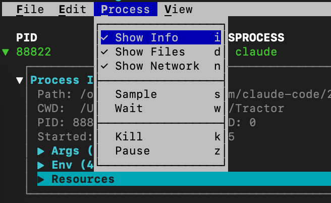

# Tractor

<p align="center">
  
</p>

**Know what your AI agents are up to.**

Tractor is a real-time process monitor for AI coding agents on macOS. It traces an agent's process tree, file activity, and network connections using the Endpoint Security framework, then presents everything in an interactive TUI.

<p align="center">
  
</p>

## Why?

AI coding agents spawn dozens of subprocesses, write to files across your filesystem, and make network requests — all in seconds. Tractor gives you visibility into this activity with low overhead.

- **Process tree** — subprocesses nested by parent-child relationship
- **File tracking** — watch which files are being written in real-time
- **Network connections** — observed connections with per-connection byte counters
- **CPU profiling** — sample any process to see where it's spending time
- **Wait diagnosis** — find out why a process is blocked

## Quick Start

```bash
git clone https://github.com/groundwater/Tractor.git
cd Tractor
make debug
sudo .build/Debug/Tractor trace --trace Terminal
```

Open a new terminal tab and run some commands — you'll see them appear in Tractor's process tree. Press `?` for keyboard shortcuts, `q` to quit.

Requires Xcode, [XcodeGen](https://github.com/yonaskolb/XcodeGen), and macOS 15+.

## Features

### Process Info, Files, and Network

Select a process and press `i` to inspect it, `d` to see file I/O, or `n` to see network connections. Or use the **Process** menu.

<p align="center">
  
</p>

<p align="center">
  
</p>

### CPU Sampling

Press `s` to capture a CPU profile. Tractor runs `sample` under the hood and displays a bottom-up call tree. Configure duration, threshold, and depth before sampling.

<p align="center">
  
</p>

### Signal Delivery

Press `k` to send a signal to the selected process.

<p align="center">
  
</p>

## Usage

```bash
# Trace any process by name (substring match)
sudo .build/Debug/Tractor trace --trace claude

# Trace a specific PID and its descendants
sudo .build/Debug/Tractor trace --pid 1234

# JSON output for scripting
sudo .build/Debug/Tractor trace --trace claude --json
```

### Keyboard

Press `?` in the TUI to see all keybindings. The essentials:

| Key | Action |
|-----|--------|
| `Up`/`Down` | Navigate process list |
| `Right`/`Left` | Expand/collapse tree nodes |
| `Enter` | Toggle disclosure |
| `Space` | Pause/resume display |
| `i` / `d` / `n` | Toggle info / files / network panels |
| `s` | CPU sample |
| `w` | Wait diagnosis |
| `k` | Send signal |
| `?` | Show all keybindings |
| `q` | Quit |

<details>
<summary>Menu bar keys</summary>

| Key | Menu |
|-----|------|
| `f` | **File** — Track, Export |
| `e` | **Edit** — Clear, Filter, Find, Copy |
| `p` | **Process** — Info, Files, Network, Sample, Wait, Kill, Pause |
| `m` | **Sample** — Resample, Delete, Export |
| `t` | **Network** — Reverse DNS and SNI status |
| `y` | **FileSystem** — Read/write display toggles |
| `v` | **View** — Show Exited, Expand/Collapse All, Columns |

</details>

## Development Setup

Tractor uses Apple's Endpoint Security framework, which requires special entitlements. For local development with an unsigned build, the most practical setup is a macOS VM with SIP disabled.

<details>
<summary>VM setup instructions</summary>

Using [GhostVM](https://github.com/groundwater/GhostVM) or any macOS VM:

```bash
# In the VM, boot into Recovery Mode (hold power button on Apple Silicon)
# Open Terminal from the Utilities menu, then:
csrutil disable

# Reboot, then run Tractor:
sudo .build/Debug/Tractor trace --trace Terminal
```

> **Note:** Disabling SIP on your primary machine is not recommended. Use a VM for development.

</details>

<details>
<summary>Production distribution</summary>

The Endpoint Security entitlement is restricted and must be authorized by a provisioning profile. For distribution: use an app-like bundle or system extension host so the profile can be embedded, sign with Developer ID and hardened runtime, notarize the artifact, and grant Full Disk Access in System Settings.

</details>

## Architecture

Tractor is built on several macOS subsystems:

- **Endpoint Security** (`AUTH_EXEC`, `NOTIFY_OPEN`, `NOTIFY_WRITE`, `NOTIFY_CLOSE`, `NOTIFY_UNLINK`, `NOTIFY_RENAME`, `NOTIFY_EXIT`) — process lifecycle and file operations
- **NetworkStatistics.framework** (private, via `dlopen`) — per-connection byte counters without spawning subprocesses
- **libpcap** — SNI extraction from TLS ClientHello packets for hostname resolution
- **proc_pidinfo / proc_pid_rusage** — disk I/O totals, CWD, open file descriptors
- **sample** — CPU profiling with inverted call tree parsing

### How It Works

1. Tractor registers an ES client with `AUTH_EXEC` to observe and promptly allow new process creation. This captures short-lived child processes.
2. The process tree is built from parent-child relationships. New agent instances are auto-discovered by matching executable names.
3. File writes are tracked via `NOTIFY_WRITE`, `NOTIFY_CLOSE` (modified), and `NOTIFY_RENAME` (for atomic saves).
4. Network connections are enumerated via the private `NetworkStatistics.framework`, giving per-connection TX/RX byte counters.
5. Hostname resolution uses a combination of reverse DNS and a packet sniffer that extracts SNI from TLS ClientHello messages.

## JSON Output

The `--json` flag outputs newline-delimited JSON events to stdout:

```json
{"type":"exec","pid":1234,"ppid":1813,"process":"/usr/bin/grep","timestamp":"...","user":501,"details":{"argv":"grep -r foo"}}
{"type":"write","pid":1813,"ppid":1753,"process":"claude","timestamp":"...","user":501,"details":{"path":"/Users/you/project/src/main.ts"}}
{"type":"exit","pid":1234,"ppid":1813,"process":"/usr/bin/grep","timestamp":"...","user":501,"details":{}}
```

## Roadmap

- [ ] TLS interception — decrypt and display API request/response content
- [ ] JS stack frames — resolve V8/Bun JIT frames via Node.js inspector protocol
- [ ] Crash detection — parse `.ips` crash reports, show crash dump inline
- [ ] Session recording/replay — save ES events to a file, replay the TUI
- [ ] Cost estimation — estimate API costs from network traffic byte counts

## License

GNU Affero General Public License v3.0
