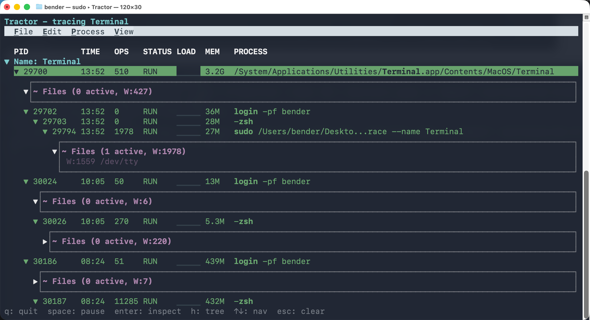

# Tractor

<p align="center">
  
<br/>
</p>

Tractor is a programmable runtime for macOS Endpoint Security and Network Extension events. Write small JavaScript probe programs that observe every exec, file operation, and network flow on the system — and optionally **deny** them in the kernel before they happen.

## Quick Start

```sh
brew tap groundwater/tractor
brew install --cask tractor

# One-time activation (per extension)
sudo tractor activate endpoint-security
sudo tractor activate network-extension

# Submit a JS probe program
sudo tractor program examples/pstree.js
sudo tractor program examples/curl-pipe-bash.js --deny
```

`Ctrl-C` unloads the program.

## Why

AI agents, build tools, and modern dev environments fan out into hundreds of subprocesses. Off-the-shelf tools each show one slice:

| Tool | Sees | Misses |
|---|---|---|
| `fs_usage` | file ops | network, exec relationships |
| `tcpdump` | packets | which process, no policy |
| `ps` / `top` | snapshots | every short-lived child |
| `nettop` | flows | file activity |
| Activity Monitor | UI snapshot | nothing real-time/scriptable |

Tractor gives you the underlying event streams and lets you correlate, render, or deny them in 50 lines of JS.

## Example: detect `curl URL | bash`

```js
// curl-pipe-bash.js
const SHELL_NAMES = new Set(["bash", "sh", "zsh"]);
const FETCH_NAMES = new Set(["curl", "wget", "fetch"]);
const pipeWriters = new Map();

probe("es:auth:exec", c => {
  // Remember every proc whose stdout is a pipe.
  const out = getFdPipe(c.pid, 1);
  if (out && out.handle) pipeWriters.set("h:" + out.handle, basename(c.process));

  // For shells with piped stdin, see who's writing the other end.
  if (!SHELL_NAMES.has(basename(c.process))) return;
  const inp = getFdPipe(c.pid, 0);
  if (!inp) return;
  const writer = pipeWriters.get("h:" + inp.peerhandle);
  if (writer && FETCH_NAMES.has(writer)) {
    c.deny();   // kernel blocks the exec
    emit("alert", { line: `BLOCKED ${writer} | ${basename(c.process)}` });
  }
});

function basename(p) { return p.split("/").pop(); }
```

Run with `sudo tractor program examples/curl-pipe-bash.js --deny`. Next time something tries `curl install.sh | bash`, the shell exec fails in the kernel.

## What's in `examples/`

| Script | What it does |
|---|---|
| `pstree.js` | Live process tree with dead-process linger. Filter by name; argv shown. |
| `top.js` | `top`-style live CPU/memory panel using `getProcStats`. |
| `nettop.js` | Per-process TCP+UDP throughput, top-N table. |
| `filewatch.js` | Live tail of writes/unlinks/renames; glob filter, tail or top mode. |
| `ancestry.js` | Every exec with its full parent chain; optional `--watch <name>`. |
| `engine-stats.js` | Self-profiler — per-program-per-probe dispatch count + p50/p99/max latency. |
| `curl-pipe-bash.js` | Detect (and optionally deny) the `curl URL \| bash` install pattern via kernel pipe-handle matching. |
| `flow-log.js`, `nettop.js`, `network-block.js` | Network flow observation / blocking. |
| `npm-guard.js`, `santa-lite.js` | Higher-level policy probes. |

## JS API

Every program is a JS source file with `probe(channel, fn)` calls. The host provides a small set of globals.

**Event channels** (subscribe with `probe(name, ctx => { ... })`):

| Channel | Fires for | Verdict capability |
|---|---|---|
| `es:auth:exec` | Every exec, before kernel allows it | `ctx.deny()` to block |
| `es:auth:create` / `auth:unlink` / `auth:rename` | File ops, pre-kernel | `ctx.deny()` |
| `es:notify:exec` | Every exec, observe-only | — |
| `es:notify:exit` | Every process exit | — |
| `es:notify:write` / `notify:unlink` / `notify:rename` | File ops, observe-only | — |
| `ne:flow:new` | New TCP/UDP flow opening | `ctx.deny()` (return non-zero) |
| `ne:flow:bytes` | Periodic byte counters during a flow | — |
| `ne:flow:close` | Flow closing with final totals | — |
| `timer:NNNms` / `timer:NNs` | Periodic from your program | — |

**Output**:
- `emit(channel, obj)` — newline-delimited JSON to the controlling CLI (and the GUI).
- `render(panelName, text)` — fixed in-place panel (top-style). Replaces previous content.
- `log(...)` — to the macOS unified log.

**Process inspection** (sync, zero or one syscall):
- `getProc(pid)` — `{pid, ppid, name, exe, started_at_ms}` from in-memory tree
- `getAncestry(pid)` / `getAncestryNames(pid)` — walk up the parent chain
- `listPids()` / `listProcs()` — snapshot of the tree
- `getProcStats(pid)` — single-pid `{rss_bytes, vsize_bytes, cpu_user_ns, cpu_system_ns, threads, ...}`
- `getFdPipe(pid, fd)` — pipe descriptor `{handle, peerhandle, inode}` or null

**Environment**:
- `args` — string array passed after the script path
- `terminalCols()` / `terminalRows()` — current TTY size
- `loadAverage()` — `[1m, 5m, 15m]`
- `ncpu()` — logical CPU count
- `engineStats()` — internal per-probe dispatch counts + latency percentiles

The engine subscribes to ES events only when at least one probe asks — when nothing's loaded, the daemon is idle.

## Loaded programs

```sh
sudo tractor programs list           # what's loaded
sudo tractor programs unload <name>  # stop one
```

Multiple programs can be loaded simultaneously and run in isolated JSCore VMs. AUTH probes merge with **first-deny-wins**: any program that returns deny blocks the operation; all others run anyway so their observation is consistent.

## Legacy: `tractor trace`

The 0.3-era fixed-purpose tracer is still included for the GUI and one-off exploration:

```sh
tractor trace --name claude --mitm
```

It produces an interactive TUI with process tree, file activity, network flows, and (with `--mitm`) decrypted HTTPS — useful when you don't want to write a probe.

<p align="center">
  
</p>

Features that remain in the legacy tracer:
- Full process tree with PID, runtime, CPU, memory, argv, env
- Real-time file writes / renames / deletes per process
- Per-flow TX/RX byte counters with hostname resolution
- **TLS interception** — transparent MITM proxy decrypts HTTPS, decoded request/response bodies with chunked + gzip support
- CPU sampling (bottom-up call tree), wait diagnosis, signal delivery
- NDJSON streaming, SQLite logging

To enable MITM:

```sh
sudo tractor activate certificate-root
```

## Installation

Recommended — installs the GUI **and** the `tractor` CLI:

```sh
brew tap groundwater/tractor https://github.com/groundwater/homebrew-tractor
brew install --cask tractor
sudo tractor activate endpoint-security
sudo tractor activate network-extension
```

Or download the signed, notarized DMG from the [Releases page](https://github.com/groundwater/Tractor/releases) and drag `Tractor.app` to `/Applications`. The drag-install ships the GUI only; the `tractor` CLI shim at `/usr/local/bin/tractor` is installed by the Homebrew cask.

Release builds are signed, notarized, and ship with the required Endpoint Security entitlement — you do **not** need to disable SIP.

## Building from source

```sh
git clone https://github.com/groundwater/Tractor.git
cd Tractor
make debug
sudo .build/Debug/Tractor activate endpoint-security
sudo .build/Debug/Tractor program examples/pstree.js
```

Requires Xcode, [XcodeGen](https://github.com/yonaskolb/XcodeGen), and macOS 15+.

Local dev builds are ad-hoc signed and need SIP disabled (use a macOS VM like [GhostVM](https://github.com/groundwater/GhostVM) with `csrutil disable` in Recovery Mode). Production distribution requires a provisioning profile with the Endpoint Security entitlement, Developer ID signing, hardened runtime, notarization, and Full Disk Access.

### Build targets

| Target | Description |
|---|---|
| `make debug` | Ad-hoc signed Debug build for local development |
| `make release` | Release `.app` bundle with embedded system extensions |
| `make notarize-app` | Sign + notarize the release `.app` |
| `make dmg` | Release DMG (calls `make release` + packaging) |
| `make dist` | Notarized DMG ready for distribution |

## License

GNU Affero General Public License v3.0
